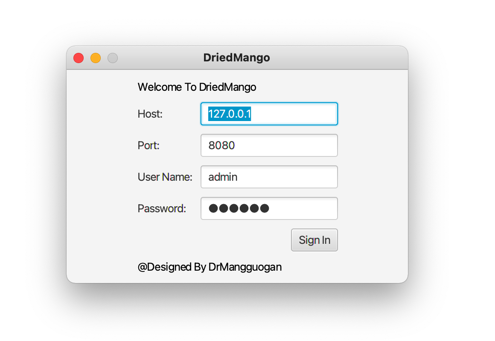
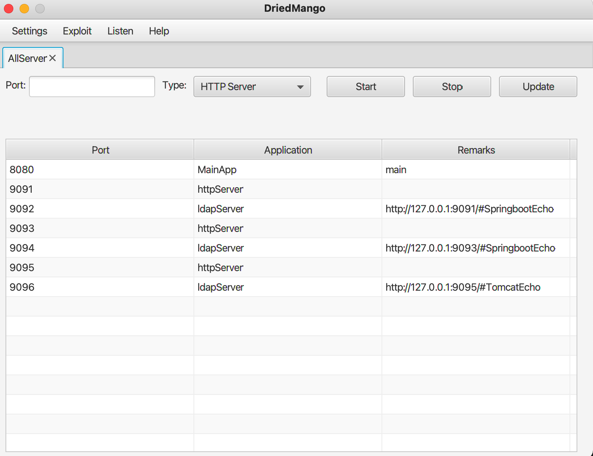
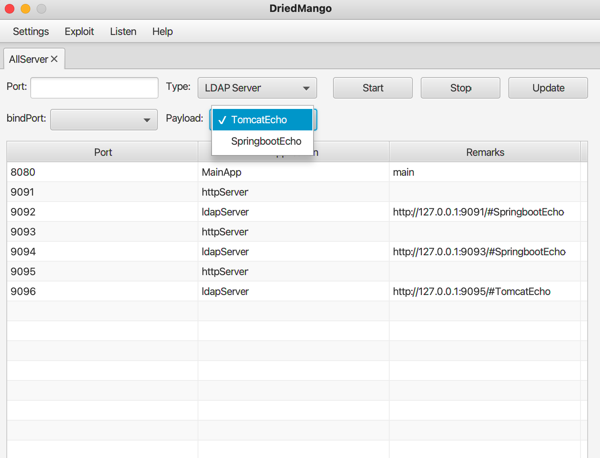
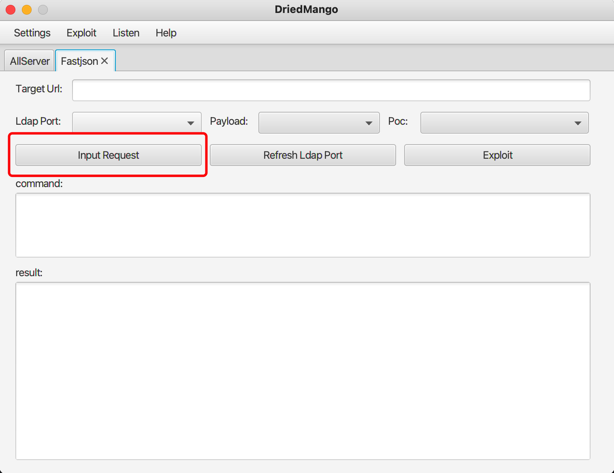
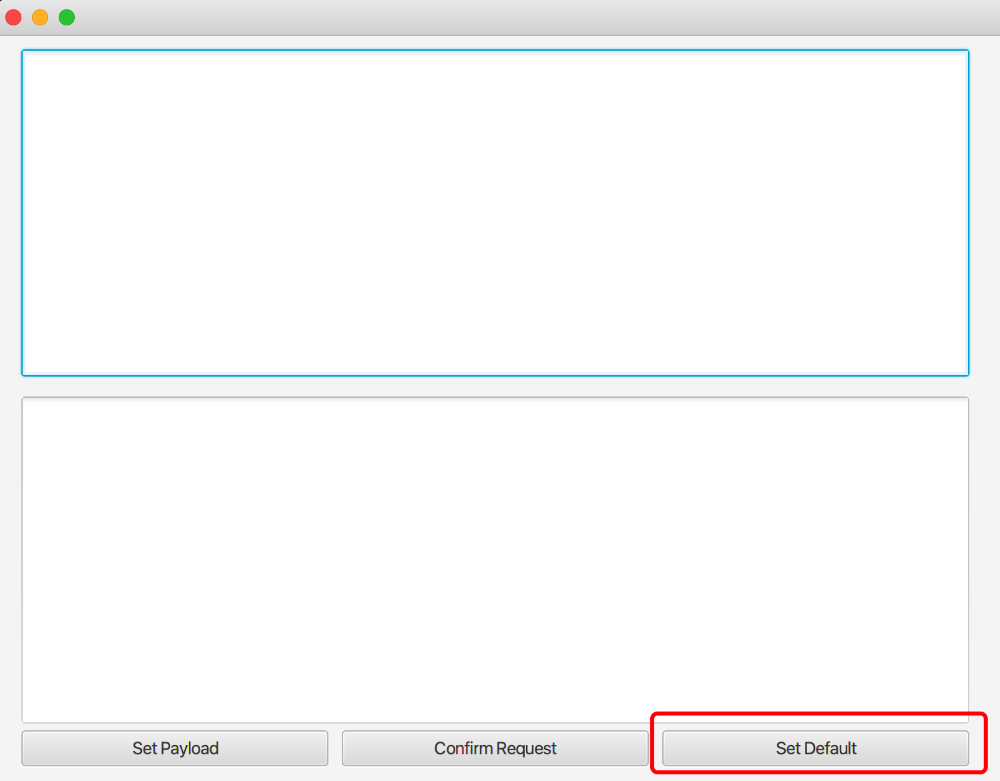

## 0x00 Introduction

一款GUI漏洞利用工具，主要辅助红队进行复杂的攻击场景的利用，如部分非http协议和异步漏洞利用。目前该版本开发较为仓促，后续会频繁迭代。

目前支持的漏洞有：

```
fastjson
jmxrmi
rmiserver 
```

## 0x01 环境搭建

jdk1.8（开发环境）

Server

```
java -jar server-0.0.1-SNAPSHOT.jar --uname=admin --pwd=123456 --host=x.x.x.x
```

Client

```
java -jar DriedMango-1.0-SNAPSHOT-jar-with-dependencies.jar
```


## 0x02 

### 1、登录

修改host，端口，用户名和密码




### 2、fastjson利用

Listen-AllServer中监听http端口，再设置ldap端口指定http端口，且设置相应的payload





Exploit--FastjsonJndi

根据提示将所有能填的项全填上，尤其途中的input request，若是想偷懒，可以直接选择默认





选择Confirm Request即可。

## 0x03、后记

可能还有许多未知bug，后续会继续维护，若有新的漏洞利用需要添加以及bug反馈，可提issue或本人微信DrMangGuoGan。


## 0x04、引用

作品引用了多个师傅的代码，由于数量较多，暂时没补上，后续一一添加，或联系本人添加。