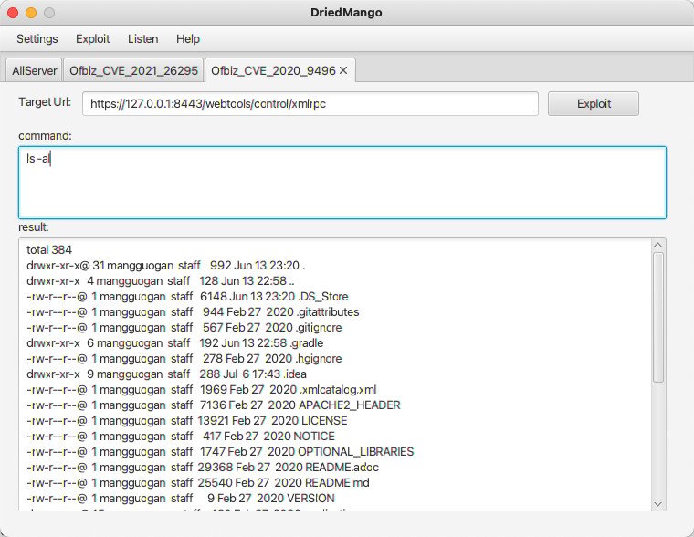

## 0x00 Introduction

一款GUI漏洞利用工具，主要辅助红队进行复杂的攻击场景的利用，如部分非http协议和异步漏洞利用。目前该版本开发较为仓促，后续会频繁迭代。

目前支持的漏洞有：

```
Fastjson漏洞回显
Jmxrmi漏洞回显
RmiServer漏洞回显
ApacheOfbiz漏洞利用回显(CVE-2021-26295,CVE-2020-9496)
```

## 0x01 环境搭建

jdk1.8（开发环境）服务端启动时，请自行修改账号密码和启动端口

Server

```
java -jar server-0.0.1-SNAPSHOT.jar --uname=admin --pwd=123456 --host=x.x.x.x --server.port=8080
```

Client

```
java -jar DriedMango-1.0-SNAPSHOT-jar-with-dependencies.jar
```


## 0x02 

### 1、登录

修改host，端口，用户名和密码


### 2、fastjson利用

Listen-AllServer中监听http端口，再设置ldap端口指定http端口，且设置相应的payload


Exploit--FastjsonJndi

根据提示将所有能填的项全填上，尤其途中的input request，若是想偷懒，可以直接选择默认


选择Confirm Request即可。


### 3、Apache Ofbiz 回显利用

CVE-2021-26295


CVE-2020-9496



更多使用：

https://xz.aliyun.com/t/9741
https://github.com/MrMeizhi/DriedMango

## 0x03 后记

可能还有许多未知bug，后续会继续维护，若有新的漏洞利用需要添加以及bug反馈可提issue。


## 0x04 引用参考

作品引用了多个师傅的代码，由于数量较多，暂时没补上，后续一一添加，或联系本人添加。

http://wjlshare.com/archives/1529#0x06

https://mp.weixin.qq.com/s/x4pxmeqC1DvRi9AdxZ-0Lw

https://www.anquanke.com/post/id/198886

https://github.com/mbechler/marshalsec

https://xz.aliyun.com/t/7348

https://xz.aliyun.com/t/7535

https://xz.aliyun.com/t/8184

https://xz.aliyun.com/t/9345

https://xz.aliyun.com/t/8324

https://github.com/dwisiswant0/CVE-2020-9496

https://kylingit.com/blog/cve-2020-9496-apache-ofbiz-xmlrpc-rce%E6%BC%8F%E6%B4%9E%E5%88%86%E6%9E%90/

